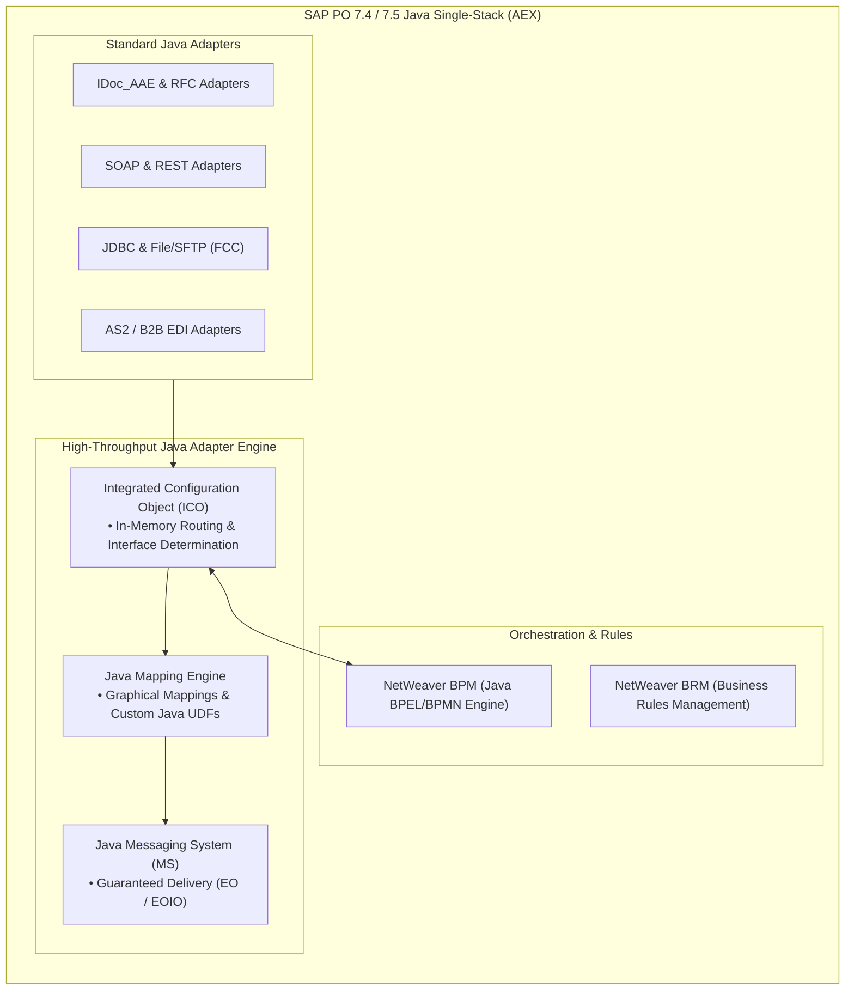

# 🏛️ SAP Process Orchestration (PO 7.4 / 7.5) Java Single-Stack (AEX) Reference & UDF Library

A comprehensive architectural reference, code library, and technical archive for **SAP Process Orchestration (SAP PO 7.4 and 7.5 Single-Stack Java AEX)**.

Essential for maintaining mission-critical enterprise Java AEX landscapes and planning smooth modernizations to **SAP BTP Integration Suite**.

---

## 📑 Table of Contents

1. [Architectural Framework: Java Single-Stack AEX](#-architectural-framework)
2. [Production Java User Defined Function (UDF) Library](#-production-java-udf-library)
3. [File Content Conversion (FCC) Mastery](#-file-content-conversion-fcc-mastery)
4. [Integrated Configuration (ICO) Architecture](#-integrated-configuration-ico-architecture)
5. [Monitoring & Diagnostics via NWA & Message Monitor](#-monitoring--diagnostics)

---

## 🏛️ Architectural Framework: Java Single-Stack AEX

SAP PO 7.4 and 7.5 Single-Stack runs entirely on the **Java Enterprise Edition (JEE) runtime**, eliminating cross-stack marshaling:

---

## ☕ Production Java User Defined Function (UDF) Library

Located in [`udfs/`](udfs/):

* **[`DynamicConfigUDF.java`](udfs/DynamicConfigUDF.java)**:
  * Uses Adapter-Specific Message Attributes (ASMA) to dynamically read or override target filenames, directory paths, and email subjects at runtime via Java `DynamicConfiguration`.
* **[`ValueMappingRFCLookup.java`](udfs/ValueMappingRFCLookup.java)**:
  * Executes a synchronous RFC call directly into SAP backend tables (e.g. `T001`, `KNA1`) using `com.sap.aii.mapping.lookup.SystemAccessor`.
* **[`Base64EncoderUDF.java`](udfs/Base64EncoderUDF.java)**:
  * Encodes or decodes binary payloads and attachments within graphical message mappings.

---

## 📄 File Content Conversion (FCC) Mastery

The File adapter's File Content Conversion engine converts flat files (CSV, fixed length, positional records) into XML.

* **[`CSV_to_XML_FCC_Parameters.txt`](fcc/CSV_to_XML_FCC_Parameters.txt)**: Comma-delimited conversion parameters with header rows and field names.
* **[`FixedLength_FCC_Parameters.txt`](fcc/FixedLength_FCC_Parameters.txt)**: Multi-record type fixed-length positional conversion (Header, Item, Trailer).

---

## 🔧 Integrated Configuration (ICO) Architecture

Single-Stack SAP PO 7.4/7.5 relies on atomic **Integrated Configuration Objects (ICOs)**:
1. **Inbound Processing**: Sender Communication Channel + Sender Agreement security.
2. **Receivers**: In-memory XPath routing conditions to determine destination business systems.
3. **Receiver Interfaces**: Message Mappings and Operation Mappings executed directly in Java memory.
4. **Outbound Processing**: Dedicated Receiver Communication Channels with specific transport protocols.

---

## 📊 Monitoring & Diagnostics

* **NetWeaver Administrator (NWA):** Monitor adapter engine communication channel status, start/stop channels, and manage thread pools.
* **Java Message Monitor:** Track message statuses (`DLVD`, `HOLD`, `FAIL`), view payload staging steps (`MS`, `AM`), and manage alert rules.
